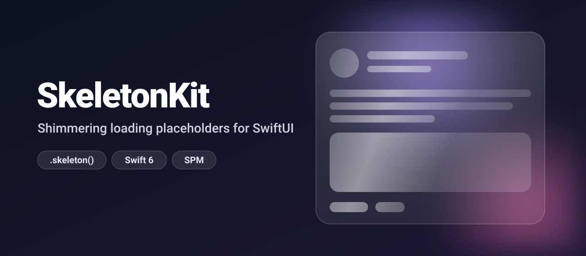
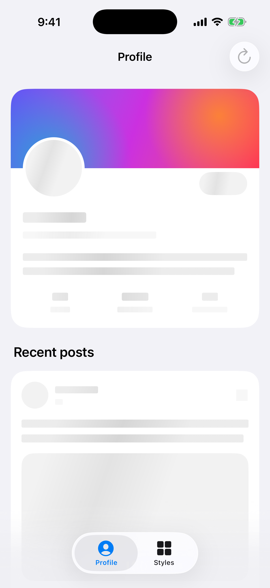
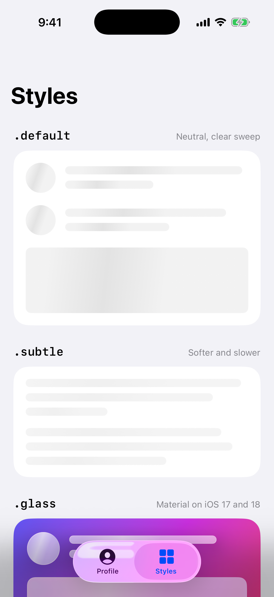
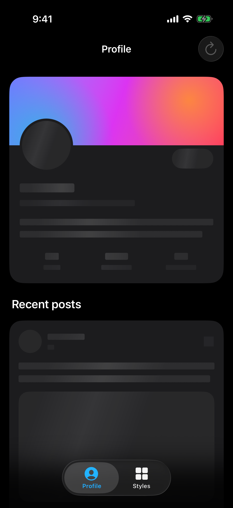
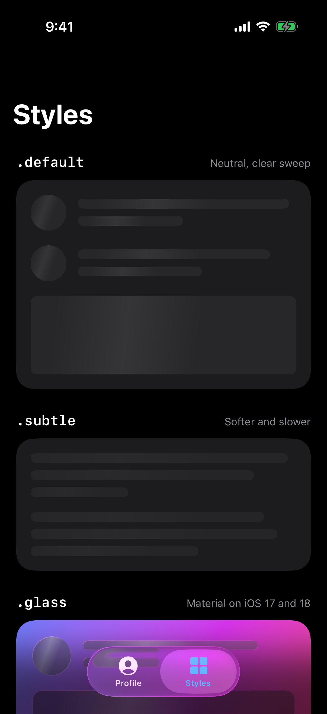

<p align="center">
  
</p>

<p align="center">
  <a href="https://github.com/halilozel1903/SkeletonKit/actions/workflows/ci.yml"></a>
  
  
  
  
  <a href="LICENSE"></a>
</p>

**SkeletonKit** turns any SwiftUI view into a shimmering skeleton while its data loads. One modifier redacts text and images into rounded placeholder bars of the same size, sweeps a gradient across them, and takes care of dark mode, Reduce Motion and VoiceOver. Primitives, a list helper and three presets, including **iOS 26 Liquid Glass**, cover the screens where no model exists yet.

```swift
PostRow(post: post ?? .placeholder)
    .skeleton(post == nil)
```

## Screenshots

Captured from the example app on an iOS 26 simulator by CI.

| Loading profile | Presets |
| :---: | :---: |
|  |  |
|  |  |

## Features

- 🦴 **`.skeleton(isLoading)`** on any view: built on `redacted(reason: .placeholder)`, so placeholders match the real layout exactly, with no second view to maintain.
- ✨ **Animated shimmer**: a linear gradient band with configurable speed, pause, angle, width, strength and highlight color.
- 🧘 **Reduce Motion**: the band is replaced by a gentle opacity pulse.
- 🧱 **`SkeletonShape` primitives**: text lines with ragged but deterministic widths, circle avatars, rounded rectangles and capsules.
- 📋 **`SkeletonList`** for N placeholder rows, with a standard avatar + lines row or your own.
- 🎨 **Presets**: `.default`, `.subtle` and `.glass` (Liquid Glass on iOS 26 / macOS 26, material fallback before), or build your own `SkeletonAppearance`.
- 🌗 **Dark mode aware**: colors derive from `Color.primary`, and the highlight is softened on dark backgrounds.
- ♿️ **Accessible**: placeholders are hidden from VoiceOver, taps are blocked, and "Loading" is announced once per screen, not once per row.
- 📸 **Snapshot friendly**: freeze the shimmer at any point with `.frozen(at:)`.
- 🧵 **Swift 6 strict concurrency**, zero dependencies.
- 🧪 **Tested** with Swift Testing: the line-width generator, shimmer math and clamping are pure value types.

## Installation

### Swift Package Manager

In Xcode choose **File › Add Package Dependencies…** and enter:

```
https://github.com/halilozel1903/SkeletonKit
```

Or add it to `Package.swift`:

```swift
dependencies: [
    .package(url: "https://github.com/halilozel1903/SkeletonKit", from: "1.0.0")
]
```

## Quick start

```swift
import SkeletonKit
import SwiftUI

struct ProfileView: View {
    @State private var profile: Profile?

    var body: some View {
        ProfileCard(profile: profile ?? .placeholder)   // any sample data with realistic lengths
            .skeleton(profile == nil)
            .task { profile = await api.profile() }
    }
}
```

While `isLoading` is `true`, the view is redacted, shimmers, ignores taps and is skipped by VoiceOver. When it turns `false`, the real content appears in place: the view keeps its identity and state, so wrap the change in `withAnimation` for a cross-fade.

## Usage

### The modifier

```swift
PostCard(post: post)
    .skeleton(isLoading)                        // uses the environment appearance
    .skeleton(isLoading, appearance: .subtle)   // or an explicit one
```

Apply it to the **content**, not to a card with an opaque background or to a `List` or `ScrollView`: everything the view draws becomes part of the placeholder.

```swift
VStack(alignment: .leading) { … }
    .skeleton(isLoading)                        // ✅ content shimmers
    .padding()
    .background(.background, in: .rect(cornerRadius: 20))   // card stays solid
```

Redaction turns text, labels and images into placeholders, but leaves shapes, gradients and controls alone. Mark those with `skeletonFill(in:)` and they become a plain placeholder shape while loading:

```swift
AsyncImage(url: user.avatarURL)
    .frame(width: 48, height: 48)
    .skeletonFill(in: Circle())

Button("Follow") { … }
    .buttonStyle(.borderedProminent)
    .skeletonFill(in: Capsule())
```

### Primitives

When there is no model yet, build the placeholder from shapes:

```swift
VStack(alignment: .leading, spacing: 16) {
    HStack(alignment: .top, spacing: 12) {
        SkeletonShape.circle(diameter: 44)
        SkeletonShape.text(lines: 2, seed: "header")
    }
    SkeletonShape.rectangle(height: 180)                    // fills the width
    SkeletonShape.rectangle(width: 64, height: 64, cornerRadius: 16)
    SkeletonShape.capsule(width: 90)
}
```

`text(lines:seed:)` draws ragged lines with a short last line. The widths come from a seeded generator, so the same seed always draws the same paragraph, on every launch and device.

### Lists

```swift
SkeletonList(count: 6)                                      // avatar + 2 lines per row
SkeletonList(count: 4, avatar: false, lines: 3)

SkeletonList(count: 3) { index in                           // your own row
    VStack(alignment: .leading, spacing: 10) {
        SkeletonShape.rectangle(height: 140)
        SkeletonShape.text(lines: 2, seed: UInt64(index))
    }
}
```

### Appearance

| Preset | Look | On iOS 17 – 18 |
| --- | --- | --- |
| `.default` | Neutral gray bars, clearly visible sweep | Same |
| `.subtle` | Lighter bars, slow and soft sweep | Same |
| `.glass` | `glassEffect(.regular)` primitives with a white highlight, for colorful backgrounds | `.ultraThinMaterial` + hairline border |

Set one for a whole screen, or build your own:

```swift
FeedView()
    .skeletonAppearance(.subtle)

let brand = SkeletonAppearance(
    fill: .indigo.opacity(0.2),          // primitives and skeletonFill(in:)
    tint: .indigo,                       // recolors redacted text and images
    highlight: .white,                   // swept with the band; nil = opacity only
    cornerRadius: 10,
    surface: .solid,                     // or .glass
    shimmer: ShimmerConfiguration(
        duration: 1.2,                   // seconds per sweep, 0.25...20
        delay: 0.4,                      // pause between sweeps
        angle: 60,                       // degrees; 0 = left to right
        bandWidth: 0.45,                 // fraction of the view
        minimumOpacity: 0.4              // placeholder opacity outside the band
    )
)
```

All values are clamped, so no configuration can break the animation. `ShimmerConfiguration.speed(_:)` scales the duration (`.speed(2)` is twice as fast).

### Shimmer without redaction

```swift
Image("hero")
    .shimmer(isDownloading, highlight: .white)
```

### Reduce Motion and VoiceOver

With **Reduce Motion** on, the band never moves: the placeholders pulse slowly between `minimumOpacity` and full opacity instead. With **VoiceOver**, placeholder content is hidden, and "Loading" is announced when a skeleton appears. Many skeletons appearing together announce once.

### Previews and snapshot tests

Freeze the shimmer so every render is identical:

```swift
FeedView()
    .skeletonAppearance(SkeletonAppearance.default.frozen(at: 0.4))
```

### Use the logic on its own

The math has no SwiftUI dependency and is fully unit tested:

```swift
SkeletonLineWidths.widths(count: 3, seed: 7)                   // e.g. [0.93, 0.81, 0.52]
SkeletonLineWidths.seed("post-42")                             // stable FNV-1a hash

ShimmerPhase.progress(time: 0.75, duration: 1.5, delay: 0.5)   // 0.5
ShimmerPhase.band(progress: 0.5, angle: 0, bandWidth: 0.5)     // start (0.25, 0.5), end (0.75, 0.5)
ShimmerPhase.pulseOpacity(time: 1, period: 2, minimum: 0.4)    // 0.4
```

## How it works

`.skeleton` applies `redacted(reason: .placeholder)`, so SwiftUI draws every text and image as a rounded bar of the same size. A `TimelineView` drives the shimmer and pauses whenever nothing is loading. Inside a compositing group, a `destinationOut` gradient lowers the placeholders' opacity outside the band and an optional `sourceAtop` gradient tints the band: both only touch pixels the placeholders already draw, so the gradient acts as a mask without clipping the view. The view hierarchy never changes shape with `isLoading`, so state, tasks and animations inside the content survive the switch.

## Example app

The `Example` folder contains a demo app with a profile feed that loads for two seconds (pull to refresh or tap ↻ to load again) and a gallery of every preset. It uses [XcodeGen](https://github.com/yonaskolb/XcodeGen) so no project file has to live in the repo:

```bash
brew install xcodegen
cd Example && xcodegen generate
open SkeletonKitDemo.xcodeproj
```

## Requirements

- Xcode 26 or later (Swift 6.2 toolchain)
- iOS 17+ / macOS 14+ (Liquid Glass automatically on 26+)

## Contributing

Issues and pull requests are welcome. Please run `swift test` before opening a PR.

## License

SkeletonKit is available under the MIT license. See [LICENSE](LICENSE).
